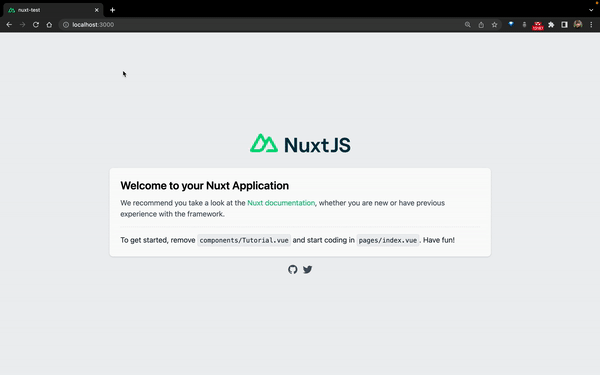
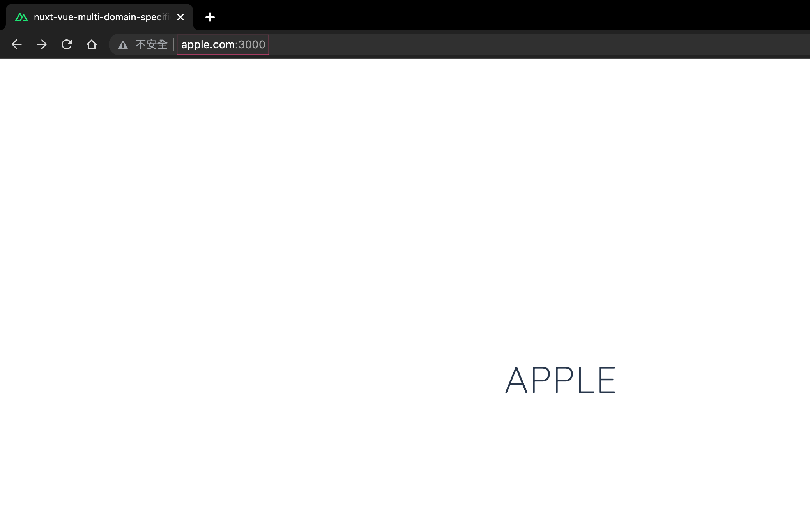
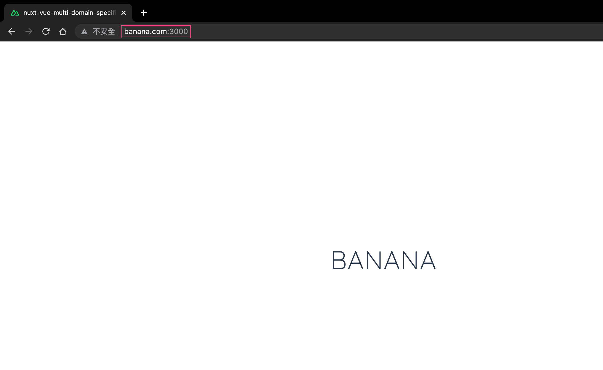

# nuxt-vue-multi-domain-specific-folder

</img>

## Demo
</img>
</img>
</img>

## Introduction

## Artical
- [Easily understand StatefulWidget LifeCycle of Flutter](https://yiichenhi.medium.com/easily-understand-statefulwidget-lifecycle-of-flutter-1064ec4ee11e)
- [“freezed” makes model class strong and easily](https://yiichenhi.medium.com/freezed-makes-model-class-strong-and-easily-cf5388bb94b7)
- [What are Async and Isolates in Flutter?](https://ab20803.medium.com/what-are-async-and-isolates-in-flutter-89c14bf6aabe)
- [LoadBalancer is optimization for Isolates in Flutter](https://ab20803.medium.com/%E5%84%AA%E5%8C%96-flutter-isolates-%E7%9A%84-loadbalancer-87ab57f210e4)
- [Flutter 3 with some good stuff!](https://yiichenhi.medium.com/flutter-3-%E6%9C%89%E4%BB%80%E9%BA%BC%E6%96%B0%E6%9D%B1%E8%A5%BF-c962e69b5ba0)

## About
Medium：[yiichenhi](https://medium.com/@yiichenhi) 
Linkedin：[yiichenhi](https://www.linkedin.com/in/yiichenhi) 
Youtube：[Yii](https://www.youtube.com/user/a22601807/videos) 
Youtube：[一起饅頭](https://www.youtube.com/channel/UC8-CcCmlIhIGcs9pdxx_BSw/videos]) 
Instagram：[yiichenhi](https://www.instagram.com/flutterluvr.yii/) 
Email：ab20803@gmail.com 
